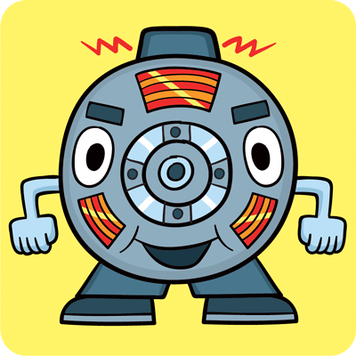
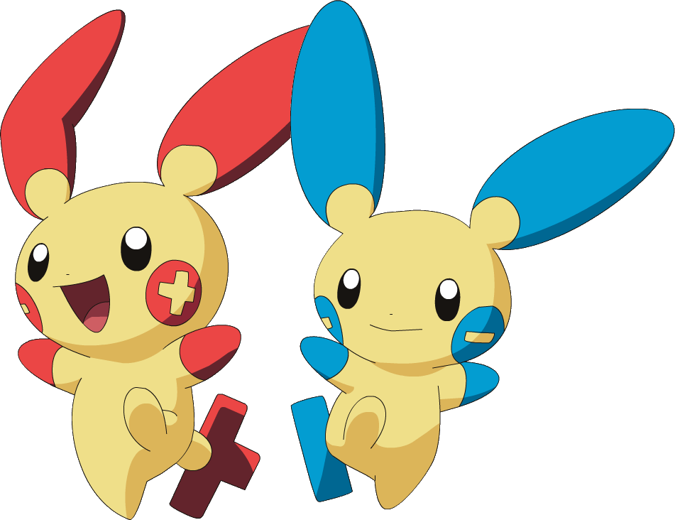
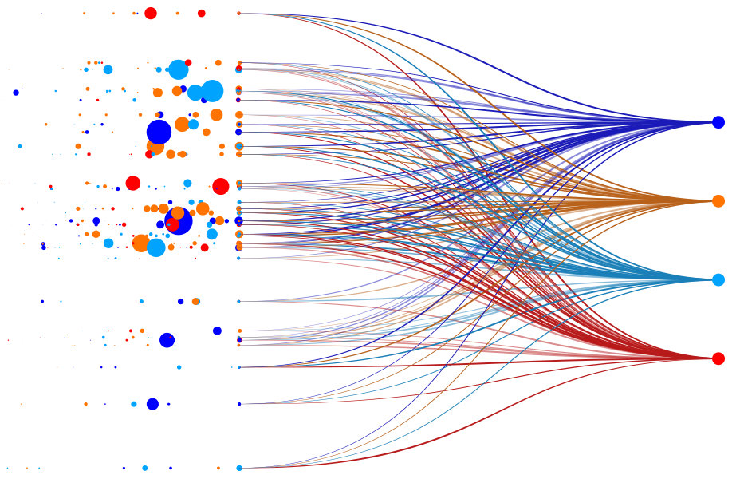
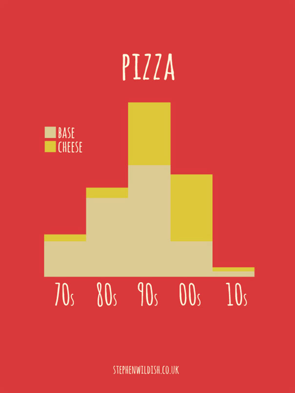
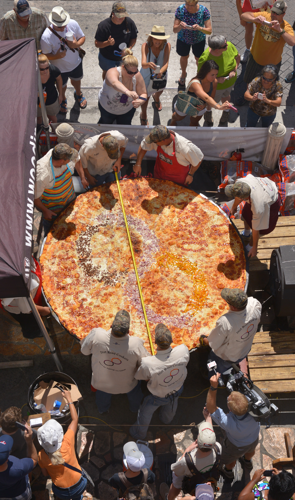

---

Asynchronous Python ODM for MongoDB

https://github.com/roman-right/beanie

---


---




---

```python
class User(BaseModel):
    id: int
    name = 'John Doe'
    signup_ts: Optional[datetime] = None
    friends: List[int] = []
```

---


```python
from typing import Optional
from beanie import Document, Indexed


class Person(Document):
    name: Indexed(str)
    twitter: Optional[str]
    rating: int = 0

    class Collection:
        name = "persons"
```

---


```python
class Team(BaseModel):
    name: str
    description: str


class Person(Document):
    name: Indexed(str)
    twitter: Optional[str]
    rating: int = 0

    team: Team
    created: datetime = Field(
        default_factory=datetime.utcnow
    )

    class Collection:
        name = "persons"
```
---


```python
team = Team(
    name="Avengers", 
    description="A group of strong enough people"
)
tony = Person(
    name="Tony Stark", 
    twitter="@Iron_Man", 
    team=team
)
await tony.create()
print(tony)

```

Output:

```python
id=ObjectId('60c11c5dbce98d02f4eee8d7') 
name='Tony Stark' 
twitter='@Iron_Man' 
rating=0
team=Team(
    name='Avengers', 
    description='A group of strong enough people'
) 
created=datetime.datetime(
    2021, 6, 9, 19, 54, 5, 596329)
```

---


```python
from pydantic import Field
from uuid import UUID, uuid4


class Sample(Document):
    id: UUID = Field(default_factory=uuid4())
```

---


---

# Get


```python
person = await Person.get(ObjectId("60c11c5dbce98d02f4eee8d7"))
```

Result:

```python
id=ObjectId('60c11c5dbce98d02f4eee8d7') 
name='Tony Stark' 
twitter='@Iron_Man' 
rating=0
team=Team(
    name='Avengers', 
    description='A group of strong enough people'
) 
created=datetime.datetime(
    2021, 6, 9, 19, 54, 5, 596329)
```

---

# Find


async generator

```python
async for person in Person.find(
        Product.team.name == "Agents"
):
    print(person)
```

list

```python
agents = await Person.find(
    Product.team.name == "Agents"
).to_list()
```

---

# Find (The) One


```python
bar = await Person.find_one(
    Person.name == "Thomas Anderson",
    Person.team.name = "Resistance"
)
```

---


#### Supported comparison operatos:

```python
==, >, >=, <, <=, !=
```

#### Example

```python
people = await Person.find(
    Person.created > datetime.datetime(2021, 6, 9)
).to_list()
```

---
# Wrappers


```python
from beanie.operators import In

red_and_blue = await Person.find(
    In(Person.team.name, ["Blue", "Red"]))
).to_list()
```

---

# MongoDB syntax


```python
people = await Person.find(
    {"name": "Joe"}
).to_list()
```

---


---



```python
people = await Person.find(
    Person.team.name = "Red"
).sort(
    -Person.created
).to_list()
```


```python
people = await Person.find(
    Person.team.name = "Red"
).sort(
    "-created"
).to_list()
```


```python
people = await Product.all().sort(
    [
        (Person.created, pymongo.DESCENDING),
        (Person.name, pymongo.ASCENDING),
    ]
).to_list()
```

---


```python
people = await Person.find(
    Person.team.name == "Blue"
).skip(2).to_list()
```

```python
people = await Person.find(
    Person.team.name == "Red"
).limit(2).to_list()
```

---

# Projections


```python
class PersonShortView(BaseModel):
    name: str
    created: int


people = await Person.find(
    Person.team.name == "Red"
).project(PersonShortView).to_list()
```

---

# Update

pic here

---

# One


```python
await Person.find_one(
    Person.name == "Bruce Wayne"
).update(Set({Person.twitter: "@TheBatman"}))

```

---

# Many


```python
await Person.find(
    Person.team.name == "Villains"
).update(Inc({Person.rating: -10}))
```

---

# Preset methods

#### Methods

```python

set(), inc(), current_date()

```

#### Example

```python
await Person.find(
    Person.team.name == "Red"
).set({Person.rating: 100})

```

---

# Wrappers


```python
from beanie.operators import Inc

await Person.find(
    Person.team.name == "Blue"
).update(
    Inc({Person.rating: 15})
)
```

---

# Native MongoDB Syntax


```python
await Person.find(
    Person.team.name == "Blue"
).update(
    {"$inc": {Person.rating: 15}
)
```

---



---



```python
class PizzaMetrics(BaseModel):
    decade: str = Field(None, alias="_id")
    base: float
    cheese: float


result = await Pizza.aggregate(
    [
        {
            "$group": {
                "_id": "$decade",
                "base": {"$avg": "$base"},
                "cheese": {"$avg": "$cheese"},
            }
        }
    ],
    projection_model=PizzaMetrics
).to_list()
```

```python
[PizzaMetrics(decade='70s', base=10, cheese=2),
 PizzaMetrics(decade='80s', base=20, cheese=4),
 PizzaMetrics(decade='90s', base=25, cheese=20),
 PizzaMetrics(decade='00s', base=10, cheese=20),
 PizzaMetrics(decade='10s', base=2, cheese=2)]
```

---

# Filter


```python
result = await Pizza.find(
    Pizza.type == "Margherita"
).aggregate(
    [
        {
            "$group": {
                "_id": "$decade",
                "base": {"$avg": "$base"},
                "cheese": {"$avg": "$cheese"},
            }
        }
    ],
    projection_model=PizzaMetrics
).to_list()
```

---

# Without projection

```python
result = await Pizza.aggregate(
    [
        {
            "$group": {
                "_id": "$decade",
                "base": {"$avg": "$base"},
                "cheese": {"$avg": "$cheese"},
            }
        }
    ]
).to_list()
```

```python
[{"_id":"70s", "base":10, "cheese":2},
 {"_id":"80s", "base":20, "cheese":4},
 {"_id":"90s", "base":25, "cheese":20},
 {"_id":"00s", "base":10, "cheese":20},
 {"_id":"10s", "base":2, "cheese":2}]
```

---

#### Methods

```python
sum(), avg(), min(), max()
```

#### Example



```python

max_margherita_diameter = await Pizza.find(
    Pizza.type == "Margherita"
).max(Pizza.diameter)

```

---


---


```python
@router.post("/persons/", response_model=Person)
async def create(person: Person):
    await person.create()
    return person
```

---

```python
@router.get("/persons/", response_model=List[Person])
async def get_list():
    persons = await Person.all().to_list()
    return persons
```

---

```python
@router.put("/persons/{person_id}/update_rating", response_model=Person)
async def update_rating(person_id: ObjectId, rating: float):
    person = Person.get(person_id)
    await person.inc({Person.rating: rating})
    return person
```

---

```python
@router.delete("/persons/{person_id}")
async def delete(person_id: ObjectId):
    person = await Person.find_one(Person.id == person_id).delete()
    return {"status": "OK"}
```
---

# Other features

- indexes
- 

---


---

# Relations

```python

class Window(Document):
    width: int
    height: int


class House(Document):
    address: str
    windows: List[Window]
    favorite_window: Window

```

---


---

# Contact me

- Twiter: @roman_the_right
- GitHub: roman-right
- Mail: roman-right@protonmail.com


